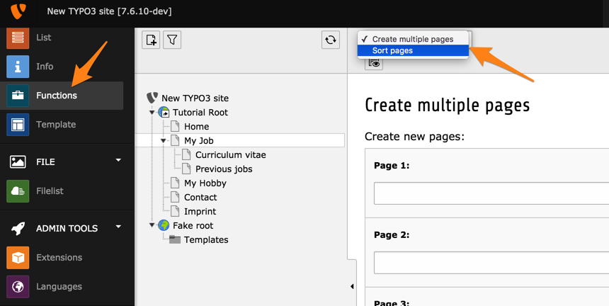

.. include:: ../../../Includes.txt

.. _backend-modules-function-menu:

Function Menu modules
^^^^^^^^^^^^^^^^^^^^^

For some old-styles modules it is possible to register additional
functions that will be added to the function menu. It is not
possible to do so for newer modules. It is not known yet whether
such a feature will be introduced or not.

The modules to which functions can be added are **WEB > Info**,
**WEB > Functions** and **WEB > Template**.

Function Menu modules are accessed through the function menu of the
host module:

In this example the **WEB > Functions** module is the host backend module
and the selector box in the upper left corner shows the two Function
menu modules attached to **WEB > Functions**.

.. _backend-modules-function-menu-registration:

Registering Function Menu modules
"""""""""""""""""""""""""""""""""

Function Menu modules are registered in an extension's
:file:`ext_tables.php` (example taken from system extension
"wizard_crpages"):

.. code-block:: php

     if (TYPO3_MODE === 'BE') {
         \TYPO3\CMS\Core\Utility\ExtensionManagementUtility::insertModuleFunction(
             'web_func',
             \TYPO3\CMS\WizardCrpages\Controller\CreatePagesWizardModuleFunctionController::class,
             null,
             'LLL:EXT:wizard_crpages/Resources/Private/Language/locallang.xlf:wiz_crMany'
         );
         ...
     }

Because a Function Menu module lives in the environment of its host backend
module, it does not need a full declaration like backend modules.
It is just a class that is called when the menu item is selected.

.. _backend-modules-function-menu-framework:

Basic framework
"""""""""""""""

The Function Menu module class inherits from class
:code:`\TYPO3\CMS\Backend\Module\AbstractFunctionModule`.
It is expected to implement a :code:`main()` method, which must
return the content to display.

The host backend module is accessible using the :code:`$pObj`
member variable.
