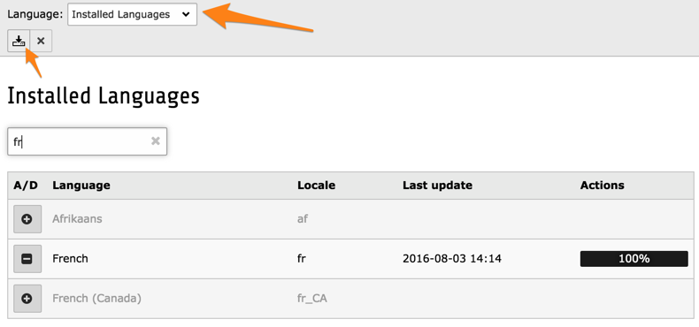

.. include:: ../../Includes.txt

.. _internationalization-localization:

Internationalization and localization
-------------------------------------

Except for some lowlevel functions, TYPO3 CMS exclusively uses localizable strings
for all labels displayed in the backend. This means that the whole user interface
can be translated. The encoding is strictly UTF-8.

The default language in English, and the Core ships only with such labels
(and so should extensions).

All labels are stored in XLIFF format, generally located in the
:file:`Resources/Private/Language` folder of an extension (old locations
may still be found in some places). Working with XLIFF files is
described in more details in :ref:`Core API <t3api:internationalization>`.

.. _adding-language:

Adding a language to TYPO3 CMS
^^^^^^^^^^^^^^^^^^^^^^^^^^^^^^

The list of supported languages is defined in
:code:`\TYPO3\CMS\Core\Localization\Locales::$languages`.
Adding support for a new language thus starts by adding
the language there and waiting for the next release.

.. _translating:

Translating TYPO3 CMS
^^^^^^^^^^^^^^^^^^^^^

Translations happen on the community translation server
(https://translation.typo3.org/) both for the Core and for
extensions. More information can be found in the
`TYPO3 wiki <http://wiki.typo3.org/Translation>`_.

.. _translations:

Fetching translations
^^^^^^^^^^^^^^^^^^^^^

The **ADMIN TOOL > Languages** module shows a list of available
languages. In the "Installed Languages" view, you can choose
which languages you would like to make available to your users.

   The Languages module, with an active search and showing status of languages

Using the "Download all" icon in the docheader, you can trigger an
update of translations for all extensions in all selected languages.
The downloaded language packs are stored in :file:`typo3conf/l10n/[language code]`.

The "Translation Overview" view of the *Languages* module offers a
fine-grained interface, where a single language pack can be downloaded.

All languages packs can also be fetched using the command line:

.. code-block:: shell

   /path/to/php /path/to/typo3/cli_dispatch.phpsh extbase language:update

.. _language-classes:

The language classes
^^^^^^^^^^^^^^^^^^^^

Various classes are involved in the localization process.

The :code:`\TYPO3\CMS\Core\Localization\LocalizationFactory` class is dedicated
to loading the language files. It also manages
:ref:`localization overrides <t3api:xliff-translating-custom>`.

The :code:`\TYPO3\CMS\Lang\LanguageService` provides the actual methods
to retrieve a localized label. :code:`getLL()` gets a label from an already
loaded language file. :code:`sL()` loads a language file first and then
returns a label from it (using a string with the :code:`LLL:EXT:...` syntax as argument).

The :code:`\TYPO3\CMS\Extbase\Utility\LocalizationUtility` is essentially
a convenience wrapper around the :code:`\TYPO3\CMS\Lang\LanguageService` class,
whose :code:`translate()` method also takes an array as argument and runs
PHP's :code:`vsprintf()` on the localized string.
